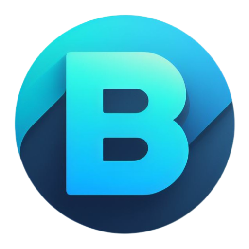
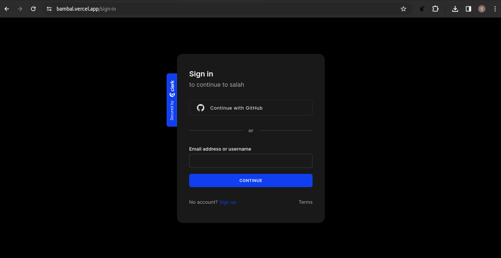
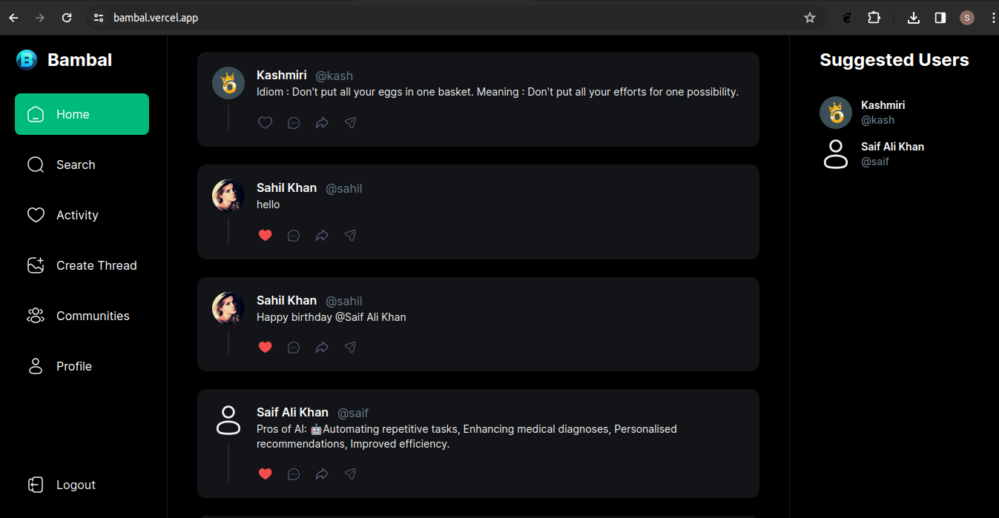
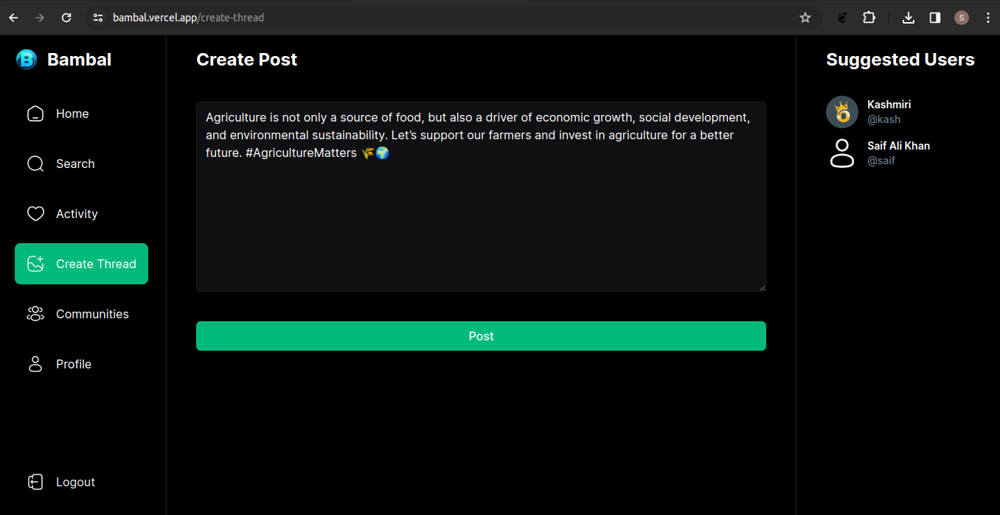
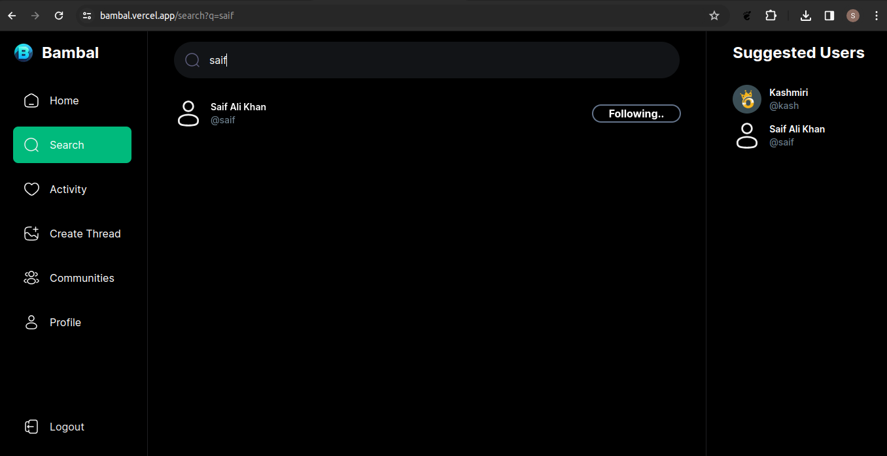
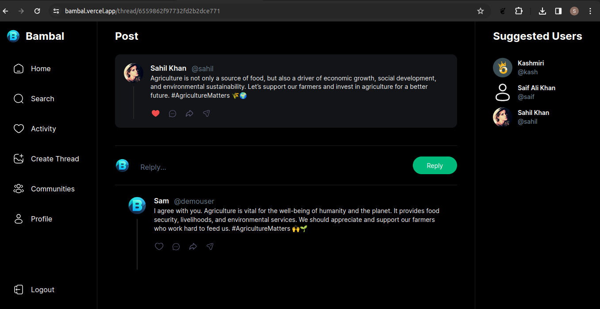

 

  

  <h3 align="center">BAMBAL : LETS RUMBLE</h3>

  

    A social media app made to serve farmers of our country!
     
  

  
  
  
  
  
  

&#xa0;

<!-- ABOUT THE PROJECT -->

## About

This is a social media app built in Nextjs using tailwindcss and mongodb.
It allows users to to create profiles , post messages , like posts and comment on other posts and follow other users.

<!-- USAGE -->

## Usage With Screenshots

Use this space to show useful examples of how a project can be used. Additional screenshots, code examples and demos work well in this space. You may also link to more resources.

- <h2>Visit Bambal</h2>
  
First click on this link or visit https://bambal.vercel.app to open app

- <h2>Login using demo credentials</h2>
  
Username = demouser and password = demo

  
- <h2>Explore posts</h2>
  
You can click on home page to scroll all available posts.

  

- <h2>Create new post</h2>
  
Click on create post enter message and hit post button.

  

- <h2>Search other users</h2>
  
Click on Search button and enter keyword for users you can follow/unfollow other users here.

  

- <h2>Reply on post</h2>
  
You can reply on any post by clicking on comment button  below post also each comment is a post in itself.

  

(<a href="#readme-top">back to top</a>)

<!-- CONTACT -->

## Contact

Sahil Khan - [@your_twitter](https://twitter.com/your_username) - sahilvr300@gmail.com

Project Link: [https://github.com/sahildev20/bambal](https://github.com/sahildev20/bambal)

(<a href="#readme-top">back to top</a>)

<!-- ACKNOWLEDGMENTS -->

## Acknowledgments

Some resources that I followed during this project that may be helpfull for you as well!

- [Nextjs Official docs](https://choosealicense.com)
- [Clerk Official docs](https://www.webpagefx.com/tools/emoji-cheat-sheet)
- [Uploadthing Official docs](https://flexbox.malven.co/)
- [Tailwind cheatseat](https://grid.malven.co/)
- [Mongoose Official docs](https://shields.io)
- [Twitter for inspiration](https://pages.github.com)
- [Threads for inspiration](https://fontawesome.com)

(<a href="#readme-top">back to top</a>)

